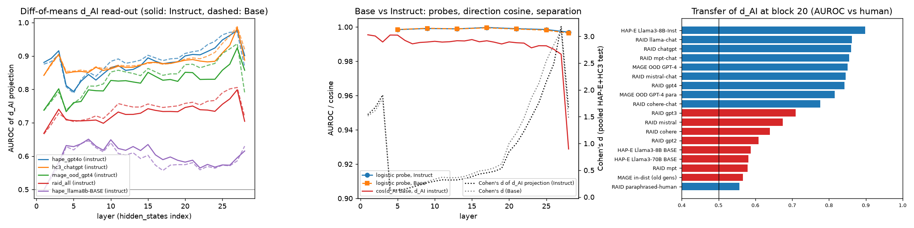
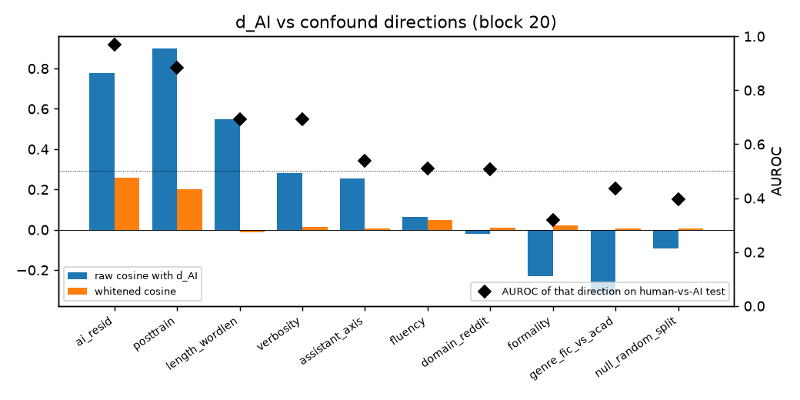
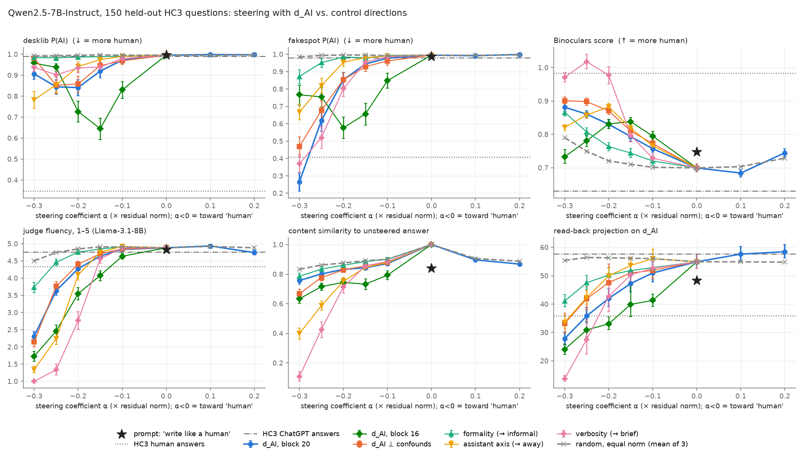
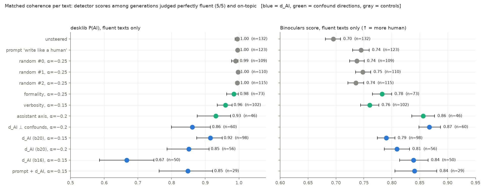
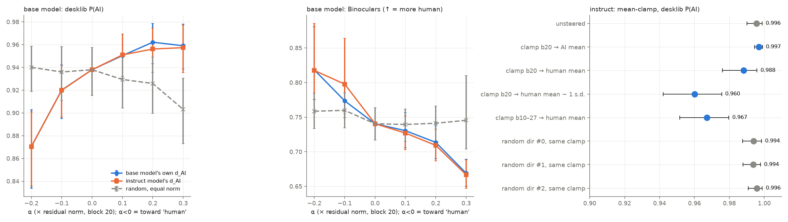

# Is there a "sounds like AI" direction in the residual stream?

**Subject models:** Qwen2.5-7B-Instruct and its base model Qwen2.5-7B.
**Experiments:** read-out, disentanglement, causal steering with controls, and base vs. instruct.
**Hardware:** 1× NVIDIA RTX A6000 (48 GB).

---

## 1. Executive summary

**Question.** A residual-stream direction separates human- from AI-written text (d_AI = AI mean − human mean on content-matched pairs). Does it *control* generation? That is: does steering the model's own output along it make the text read as more or less AI-written to independent detectors, with content and coherence held fixed? And is it a distinct direction, or a relabelling of formality, verbosity, domain, fluency, or the Assistant persona?

**Answer: yes, partly.** d_AI is causal, specific, and distinct from the confounds we measured. It is a weak lever, not a humanizer.

**Steering toward "human" (Qwen2.5-7B-Instruct, block 20).**
- Lowers the supervised detectors: desklib P(AI) 0.996 → 0.84 and fakespot 0.994 → 0.85 at α = −0.2.
- Raises the zero-shot Binoculars score from 0.70 to 0.83, i.e. more human.
- Three equal-norm random directions leave desklib at 0.99 (paired difference vs. random −0.15, p < 1e-10).
- The effect survives per-text matched coherence. Among generations an LLM judge rated perfectly fluent and on-topic, desklib is 0.85 for d_AI vs. 0.99–1.00 for random directions and 0.98 for a formality direction (Fig. 2).
- The "write like a human" system prompt does not move desklib at all (0.996).
- **Caveat from the second measure.** A blind Cohere LLM judge (only weakly valid: AUROC 0.71 on real human vs. ChatGPT answers) also rates d_AI-steered text as less AI-like (−6.2/100 vs. unsteered, −4.1 vs. random). On this judge, however, the formality direction (−8.3) and the "write like a human" prompt (−6.7) do as well or better. So specificity is established only for the trained detectors.
- Block 16 is stronger but less clean: desklib 0.67 among fluent texts, with 30% of them classified human.
- Adding d_AI and a "write like a human" prompt together reaches 0.85.

**Disentanglement.**
- In whitened (Mahalanobis) geometry, d_AI is nearly orthogonal to formality, fluency, word-length, domain, verbosity and the assistant axis (|cos| ≤ 0.05).
- Projecting all six confounds out (d_AI⊥) leaves a direction that still steers the detectors as well as d_AI does (desklib 0.86 at α = −0.2, fluent texts).
- Steering along formality, verbosity or the assistant axis at matched coherence moves the detectors much less.
- The one large overlap is with a *post-training* direction (Llama-3 instruct vs. base continuations of the same prefix): raw cos 0.90, whitened 0.20.
  - d_AI transfers to chat/instruct generators (AUROC 0.78–0.90 across RAID, MAGE-OOD and HAP-E) but barely to base-model generators (0.58).
  - So it is better described as a **"chat-tuned style" direction** than as "machine-written text" in general.

**Base vs. instruct.** The direction is already present in the pretrained base model and is not amplified by chat tuning:
- cos(d_AI^base, d_AI^instruct) = 0.99 at every layer;
- read-out AUROC and separation in the base model are equal or slightly larger (Cohen's d at block 20: 1.20 base vs. 1.00 instruct);
- steering the base model works in both directions, with its own direction or the instruct model's: desklib 0.94 → 0.87 at α = −0.2, Binoculars 0.74 → 0.67 at α = +0.3, random flat.
- Qwen2.5-7B base answers in Q/A format are themselves rated AI-like by the detectors (desklib 0.94).

**Limits.**
- The effect is far from human level: human answers to the same questions score desklib 0.35.
- Pushing harder breaks coherence before reaching it.
- An *in-distribution* intervention moves the detectors only slightly (desklib −0.03 vs. random, significant): clamping the d_AI coordinate to the mean of human text.
- Useful shifts need additive steering of about 3× the natural human–AI separation.

**Implications.**
- Supervised detectors key partly on one linear feature that the generator itself uses, and that feature is shared with the base model.
- "Sounding like AI" is not the same direction as "being the Assistant" (whitened cos 0.005). Steering the assistant axis changes detector scores only by wrecking fluency and content.
- One direction is not enough to evade detection while keeping quality. Whatever else makes text read as AI is not captured by this single direction.

---

## 2. Research question and motivation

| | |
|---|---|
| **Hypothesis H1 (read-out)** | A diff-of-means direction from content-matched pairs separates human vs. AI text at mid layers and transfers to unseen datasets and generators. |
| **H2 (causal)** | Subtracting it during generation lowers AI-ness on ≥ 2 independent measures, more than an equal-norm random direction, at matched coherence and content; adding it raises AI-ness. |
| **H3 (distinct)** | It is not formality, fluency/perplexity, word length, domain (Reddit), verbosity, or the Assistant axis; the version with these projected out still steers. |
| **H4 (base vs. instruct)** | It exists in the base model; it is (or is not) amplified by chat tuning. |

**Why it matters.**
- A steerable AI-ness direction bears on machine-text detection and its evasion.
- It bears on whether "sounding like AI" is the same thing as "being the Assistant" (Lu et al., *The Assistant Axis*).
- It bears on whether models internally represent "this text was written by a model".

**Gap.** Prior work only *reads* the direction, for detection:
- Quaremba et al. 2608.24780 (linear probes beat 16 detectors);
- SV-Detect 2606.07313 (per-layer human-vs-AI steering vectors used as detectors);
- Steer-to-Detect 2605.12890;
- Kuznetsov et al. 2503.03601, whose SAE-feature steering is qualitative.

None tests whether the direction controls writing under random, confound and prompt baselines with independent detectors. None relates it to the Assistant axis or compares it between base and instruct models.

---

## 3. Experimental setup

### 3.1 Data (`src/build_data.py`; `results/texts.jsonl`, 10.7 k texts)

| Set | Use | Construction |
|---|---|---|
| **HAP-E** (browndw/human-ai-parallel-corpus) | fitting + test | Same human prefix → human continuation vs. GPT-4o, Llama-3-70B-Instruct, Llama-3-8B-Instruct (unseen generator), Llama-3-8B/70B **base**. 6 genres; 150 train + 60 test docs per genre. |
| **HC3** (Hello-SimpleAI/HC3) | fitting + test | Same question → human vs. ChatGPT answer. 5 domains, 700 train / 260 test questions. HC3's pre-tokenised human text is de-tokenised (`normalize_hc3`). |
| **RAID** subset | transfer only | 11 generators (base and chat), 8 domains, plus paraphrased-human texts. Sampling decoding, no repetition penalty. |
| **MAGE** | transfer only | In-distribution test (older generators) and OOD GPT-4 / GPT-4-paraphrased sets. |
| **Steering prompts** | E3/E4 | 150 HC3 questions never used for fitting (30 per domain) + 30 pilot questions. The HC3 human and ChatGPT answers are kept as references. |

**Length/content control.** Each matched pair (same prefix or same question) is truncated to the same number of Qwen tokens (≤ 128). References are truncated to 120 words, comparable to the 160-token generations.

### 3.2 Activations and directions (`src/extract_acts.py`, `src/directions.py`, `src/confound_gen.py`)

**Activations.** Raw text with no chat template. Residual stream mean-pooled over tokens (attention-sink first token excluded), at every layer, for both models.

**d_AI.** Average of unit diff-of-means directions from HAP-E (GPT-4o + Llama-70B-Instruct vs. human) and HC3 (ChatGPT vs. human), on train documents.

**Confound directions** (same model, same layer):

| Direction | Construction |
|---|---|
| formality | Human texts only; top vs. bottom tercile of the s-nlp formality ranker, within genre/domain strata. |
| fluency | Human texts; high vs. low mean token log-prob under the model. |
| word length | Lexical sophistication. |
| domain | HC3 Reddit-ELI5 vs. other sources (the "Reddit vs. encyclopedic" confound). |
| post-training | Llama-3 instruct vs. base continuations of the same HAP-E prefix. |
| **assistant axis** | Cheap rebuild of Lu et al.: default-assistant responses vs. responses under 40 role-play system prompts (role list from `code/assistant-axis`), 20 questions; response-token activations. |
| **verbosity** | "Be extremely brief" vs. "be long and detailed" responses. |

**d_AI⊥.** d_AI orthogonalised against the span of formality, fluency, word-length, domain, assistant axis and verbosity. cos(d_AI, d_AI⊥) = 0.78.

### 3.3 Steering (`src/steer.py`, `src/steer_extra.py`)

**Generation settings.**
- Chat template.
- Sampling: temperature 0.7, top-p 0.95, 160 new tokens.
- The same seed for every condition, so conditions are paired per prompt.

**Additive steering.** h ← h + α·‖h̄‖·unit(v) at the output of one block, at all positions. ‖h̄‖ = 355.7 is the mean residual norm at block 20 on the prompts.

**Layer and α choice.** Chosen on 30 separate pilot prompts, before the main run (`results/steer_config.json`).
- Block 20 kept English and gave the best content preservation.
- Useful window α ∈ [−0.1, −0.3]; text collapses beyond it.
- Block 16 run as a secondary layer.

**Conditions** (150 prompts each; 9,000 main generations):

| Group | Conditions |
|---|---|
| none | no steering |
| d_AI | α ∈ {−0.1, −0.15, −0.2, −0.25, −0.3, +0.1, +0.2} |
| d_AI⊥ | 5 negative α |
| confound directions | formality, assistant axis, verbosity: 5 negative α each (negative = toward informal / away from the Assistant / brief) |
| random null | 3 random directions of equal norm, at the same 5 α |
| block 16 | d_AI and random at the same 5 α |
| zero-ablation | of d_AI at all layers; single-direction; blocks 10–27 only |
| prompting | "write like a human" system prompt, alone and combined with d_AI (α = −0.15) |

**Mean-clamp (E3b).** The d_AI coordinate is replaced by a target, leaving everything else unchanged. Targets: the human-text mean, the AI-text mean, or the human mean − 1 s.d., at block 20; or the human mean at each of blocks 10–27. Controls: the same clamp on 3 random directions.

**Base model (E4).** Prompt format "Question: …\nAnswer:"; α ∈ {−0.2, −0.1, +0.1, +0.2, +0.3} with:
- the base model's own d_AI,
- the instruct model's d_AI,
- a random direction.

### 3.4 Measures. All are independent of the activations the direction was fit on.

**AI-ness.**

| Measure | Details |
|---|---|
| **desklib/ai-text-detector-v1.01** | Supervised DeBERTa-v3-large; P(AI). |
| **fakespot-ai/roberta-base-ai-text-detection-v1** | Supervised RoBERTa; P(AI). |
| **Binoculars** | Zero-shot. Falcon-7B observer / Falcon-7B-instruct performer. Different model family. Lower = more machine-like. |
| **LLM judges** | Blind to condition; 0–100 "probability this answer was written by AI", plus fluency and relevance on 1–5 scales (`src/judge.py`, full prompt there). |

The LLM judges:
- **Llama-3.1-8B-Instruct**: local, greedy, all texts.
- **Cohere command-a-plus-05-2026**: stratified subset of 14 key conditions × 50 prompts.
- **Nemotron-3-Super-120B** (OpenRouter, free tier): partial run (1,035 texts) before its daily cap.

**Validity check.** AUROC on the 150 human vs. 150 ChatGPT reference answers to the same questions:

| Measure | AUROC human vs ChatGPT | mean human | mean ChatGPT |
|---|---|---|---|
| desklib | **0.994** | 0.35 | 0.99 |
| fakespot | **0.981** | 0.41 | 0.98 |
| Binoculars | **0.999** | 0.98 | 0.63 |
| d_AI read-back projection | 0.898 | 35.8 | 57.6 |
| Falcon log-ppl (not a detector) | 0.944 | 2.43 | 1.37 |
| Llama-3.1-8B judge AI-likelihood | **0.479 (chance)** | 62.4 | 62.3 |
| Cohere judge AI-likelihood (50 + 50 refs) | 0.709 (weak) | 54.5 | 69.8 |

The **local Llama judge cannot tell human from ChatGPT text**, so we use it only for fluency and relevance, never as an AI-ness measure. The Cohere judge is only weakly valid. Our AI-ness conclusions rest mainly on desklib + fakespot (supervised) and Binoculars (zero-shot), with the Cohere judge as a secondary, noisier check.

**Coherence and content.**
- Judge fluency and relevance;
- Falcon-7B log-perplexity;
- distinct-2;
- fraction English;
- all-mpnet-base-v2 cosine similarity to the unsteered answer for the same prompt and seed.

**Manipulation check.** Every output is read back by the *unsteered* instruct model and projected onto d_AI (`src/readback.py`).

**Statistics.**
- Paired per prompt.
- Bootstrap 95 % CIs (2,000 resamples).
- Wilcoxon signed-rank, with Holm correction within each table.
- Mann-Whitney for the per-text matched-fluency subsets (unpaired after filtering).

---

## 4. Results

### 4.1 E1: Read-out and generality (H1 supported; transfer is to *chat* generators)

**Diff-of-means d_AI at block 20** (mean-pooled raw text, AUROC on held-out documents):

| Test set | Instruct | Base |
|---|---|---|
| HAP-E GPT-4o vs human (same prefix) | 0.905 | 0.913 |
| HAP-E Llama-3-8B-Instruct (unseen generator) | 0.899 | 0.909 |
| HC3 ChatGPT vs human (same question) | 0.889 | 0.894 |
| fit on HAP-E → test HC3 / fit on HC3 → test HAP-E | 0.88 / 0.85 | 0.89 / 0.87 |
| MAGE OOD GPT-4 / GPT-4-paraphrased | 0.85 / 0.82 | 0.88 / 0.85 |
| RAID chat models (chatgpt, gpt4, llama-chat, mistral-chat, mpt-chat) | 0.84–0.86 | 0.85–0.87 |
| RAID base/older LMs (gpt2, gpt3, mpt, mistral, cohere) | 0.58–0.71 | 0.59–0.72 |
| HAP-E Llama-3-8B/70B **base** continuations | 0.59 / 0.58 | 0.58 / 0.58 |
| MAGE in-distribution (older generators) | 0.57 | 0.58 |
| RAID paraphrased-human vs human | 0.56 | 0.55 |
| logistic probe, matched test (all layers 4–27) | 0.997–0.9997 | 0.996–0.9995 |
| 10 random directions (HC3, block 14) | 0.27–0.67 | – |

**Reading.**
- A single diff-of-means direction separates content-matched human/AI pairs well (AUROC ≈ 0.89–0.91).
- It transfers across datasets (HAP-E ↔ HC3) and to unseen instruct generators.
- It fails on text from *base* LMs.
- A full logistic probe is near-perfect (0.999), replicating 2608.24780, but it uses many directions.
- The 1-D direction is a cleaner object for steering.

**Caveat on random directions.** Single random directions reach AUROC up to 0.67 or down to 0.27, because the residual stream is anisotropic. So moderate AUROCs (≤ 0.7) for any one direction are not meaningful.

### 4.2 E2: Disentanglement (H3 supported, with one caveat)

**Directions at block 20.** The whitened column (Mahalanobis geometry) removes the shared anisotropic component. In the raw column, even a *random human/human split* has cos 0.44 with formality, so raw cosines are inflated.

| | raw cos with d_AI | whitened cos | AUROC (matched test) |
|---|---|---|---|
| d_AI | 1 | 1 | 0.869 |
| formality | −0.23 | 0.02 | 0.32 (i.e. AI text is *more* formal; 0.68 flipped) |
| fluency (log-prob) | 0.06 | 0.05 | 0.51 |
| word length | 0.55 | −0.01 | 0.69 |
| domain (Reddit) | −0.02 | 0.01 | 0.51 |
| verbosity | 0.28 | 0.01 | 0.69 |
| **assistant axis** | 0.25 | **0.005** | 0.54 |
| post-training (Llama inst − base) | **0.90** | 0.20 | 0.88 |
| d_AI⊥ (6 confounds removed) | 0.78 | 0.26 | **0.970** |
| null: random human/human split | −0.09 | 0.008 | 0.39 |

**Projection and regression checks.**
- Projecting out the 6-confound subspace and re-fitting *raises* diff-of-means AUROC from 0.89 to 0.98. The logistic probe stays at 0.998. The confounds were adding noise, not signal.
- Cross-validated logistic regression of the label on 9 text covariates + domain dummies gives AUROC 0.944. The covariates are formality, log-prob, word length, length, contractions, AI-ism lexicon, distinct-2, first person and markdown.
- Adding the d_AI projection raises it to 0.956. The projection alone gives 0.869.
- So d_AI carries information beyond surface style statistics, but it overlaps with them. Its correlations with covariates are |r| ≤ 0.38: longer words, fewer contractions, less first person.

**The one large overlap.** d_AI almost coincides (raw cos 0.90) with the *post-training* direction from a different model family (Llama-3 instruct − base continuations). Together with the E1 transfer pattern, this says d_AI encodes the style that **instruction/chat tuning** produces, not "machine-generated" per se.

### 4.3 E3: Causal steering (H2 supported for detectors; weak overall)

**Table: steering at block 20.** Means over 150 prompts; full table with CIs in `results/steer_main_summary.csv`.

| condition | desklib ↓ | fakespot ↓ | Binoculars ↑ | judge fluency | relevance | sim. to unsteered | read-back proj. |
|---|---|---|---|---|---|---|---|
| unsteered | 0.996 | 0.994 | 0.700 | 4.88 | 4.89 | 1.00 | 54.9 |
| d_AI α=−0.1 | 0.972 | 0.978 | 0.757 | 4.83 | 4.89 | 0.87 | 51.0 |
| d_AI α=−0.15 | 0.920 | 0.944 | 0.793 | 4.64 | 4.85 | 0.84 | 47.2 |
| **d_AI α=−0.2** | **0.841** | **0.853** | **0.830** | 4.27 | 4.72 | 0.83 | 42.0 |
| d_AI α=−0.25 | 0.845 | 0.619 | 0.860 | 3.63 | 4.10 | 0.80 | 35.8 |
| d_AI α=−0.3 | 0.906 | 0.266 | 0.881 | 2.31 | 2.52 | 0.76 | 27.8 |
| d_AI α=+0.2 | 0.998 | 0.999 | 0.745 | 4.74 | 4.62 | 0.87 | 58.4 |
| d_AI⊥ α=−0.2 | 0.858 | 0.854 | 0.871 | 4.40 | 4.61 | 0.83 | 47.6 |
| random (mean of 3) α=−0.2 | 0.995 | 0.996 | 0.721 | 4.85 | 4.80 | 0.88 | 56.3 |
| random (mean of 3) α=−0.3 | 0.993 | 0.986 | 0.790 | 4.50 | 4.53 | 0.83 | 55.4 |
| formality α=−0.25 | 0.983 | 0.952 | 0.807 | 4.46 | 4.66 | 0.83 | 47.5 |
| formality α=−0.3 | 0.985 | 0.872 | 0.866 | 3.73 | 4.00 | 0.79 | 41.1 |
| assistant axis α=−0.2 | 0.941 | 0.954 | 0.882 | 4.09 | 3.57 | 0.75 | 49.9 |
| assistant axis α=−0.3 | 0.783 | 0.667 | 0.821 | 1.34 | 1.02 | 0.40 | 33.6 |
| verbosity α=−0.15 | 0.939 | 0.955 | 0.797 | 4.56 | 4.71 | 0.86 | 50.3 |
| block-16 d_AI α=−0.15 | 0.645 | 0.656 | 0.838 | 4.07 | 4.33 | 0.73 | 39.9 |
| prompt "write like a human" | 0.996 | 0.988 | 0.747 | 4.83 | 4.89 | 0.84 | 48.4 |
| prompt + d_AI α=−0.15 | 0.835 | 0.899 | 0.851 | 4.11 | 4.73 | 0.76 | 32.8 |
| zero-ablation of d_AI (all layers) | 0.967 | 0.317 | 0.861 | **1.00** | 1.00 | 0.03 | 74.8 |
| *HC3 human answers* | *0.348* | *0.408* | *0.982* | *4.33* | *4.26* | – | *35.8* |
| *HC3 ChatGPT answers* | *0.990* | *0.978* | *0.630* | *4.75* | *4.83* | – | *57.6* |

**d_AI vs. the three random directions at equal α** (paired per prompt, `results/steer_ai_vs_random.csv`):

| α | Δ desklib | Δ Binoculars | Δ fluency |
|---|---|---|---|
| −0.15 | −0.077 | +0.083 | −0.27 |
| −0.2 | −0.154 [−0.20, −0.11], p < 1e-10 | +0.109 | −0.58 |

All the differences are significant (p < 1e-3).

**Matched coherence, two ways.**

*(a) Per condition.* Take the strongest α for each method whose mean judge fluency and relevance stay within 0.5 of unsteered and that keeps ≥ 95 % English output (`results/steer_matched_coherence.csv`):

| method | desklib |
|---|---|
| d_AI⊥ (α = −0.2) | 0.86 |
| d_AI (α = −0.15) | 0.92 |
| assistant axis (α = −0.15) | 0.97 |
| formality (α = −0.25) | 0.98 |
| random (α = −0.3) | 0.99 |
| prompt | 0.996 |

*(b) Per text (Fig. 2).* Keep only generations judged fluency = 5/5, relevance ≥ 4, English. Detector shifts then cannot come from broken text.
- d_AI α = −0.2: desklib **0.85** (n = 56).
- d_AI⊥: 0.86.
- block-16 d_AI α = −0.15: **0.67**, with 30 % of these perfectly fluent texts classified human by desklib.
- assistant axis: 0.93.
- verbosity: 0.96.
- formality: 0.98.
- random: 0.99–1.00.
- prompt: 1.00.
- All d_AI conditions differ from unsteered at p < 1e-4 (Mann-Whitney). Two of three random directions are n.s.

**Binoculars must be read with care.**
- It rises for every perturbation, including random directions (+0.09 at α = −0.3), because steering raises perplexity.
- Even among fluent texts, random α = −0.25 moves it from 0.70 to 0.74, against 0.81 for d_AI.
- The supervised detectors do not move with random directions. That is why we lean on them for specificity.

**Positive steering.** Adding d_AI cannot raise the supervised detectors: they are at their ceiling of 0.996. It does raise the read-back projection (54.9 → 58.4, ChatGPT-reference level) and, at α = +0.1, lowers Binoculars, i.e. more machine-like (0.70 → 0.68, p = 0.001). The base model, which is not at ceiling, shows the positive direction clearly (§4.5).

**Qualitative examples.** Same prompt and seed (`results/gen_main.json`).
- Unsteered: *"The forms 1099-MISC and K-1 serve different purposes in the tax system… Let's break down each form: 1. **1099-MISC**: This is an information return used to report…"*
- d_AI α = −0.25: *"I think you are mixing up two different things in taxation here: 1099-MISC and K-1. They are not to do with duplicate numbers, but are two differents tax forms…"*

Steering toward "human" brings in first-person hedging, informal abbreviations ("co's") and small errors ("differents", "Capitol"). The answer stays on topic and keeps its structure. Part of what the detectors read as "human" is therefore *less polish*, which judge fluency registers as a drop from 4.9 to 4.3–4.6.

**Manipulation check.** The unsteered model reads the steered outputs as fully human-like. At α = −0.25 their read-back projection (35.8) equals that of the real human answers (35.8). Detector P(AI) is still 0.85 against 0.35 for those human answers. Moving the model's own d_AI coordinate to the human level captures only part of what external detectors respond to.

**Zero-ablation is not a valid "remove AI-ness" test here.** Zeroing the d_AI coordinate at every layer destroys the text (fluency 1.0). The human mean projection is not zero (32 at block 20), so zeroing pushes activations off-distribution. The mean-clamp in §4.4 is the in-distribution version.

### 4.4 E3b: In-distribution mean-clamp (small but specific)

Paired vs. unsteered, Holm-corrected (`results/steer_extra_paired.csv`):

| condition | desklib | Binoculars | fluency | read-back proj. |
|---|---|---|---|---|
| unsteered | 0.996 | 0.700 | 4.88 | 54.9 |
| clamp b20 → AI mean | 0.997 (n.s.) | 0.701 (n.s.) | 4.89 | 54.9 |
| clamp b20 → human mean | 0.988 (p_holm = 5e-4) | 0.727 | 4.89 | 53.1 |
| clamp b20 → human mean − 1 s.d. | **0.960** | **0.757** | 4.82 | 50.7 |
| clamp b10–27 → human mean | 0.967 | 0.749 | 4.79 | 46.7 |
| random dirs, same clamp (3) | 0.994–0.996 (n.s.) | 0.698–0.704 (n.s.) | 4.91–4.93 | 54.8–55.0 |

**Clamp to human mean − 1 s.d. vs. the random clamps:** Δdesklib −0.034 [−0.052, −0.020] and ΔBinoculars +0.057, both p_holm < 1e-4.

**Reading.**
- Clamping to the AI mean does nothing. The model's generations already sit at the AI mean (54.9 vs. 53.6), which is a consistency check.
- Moving the coordinate to the human-text range produces a real, d_AI-specific shift with no fluency cost. But it is small.
- The additive α = −0.2 intervention shifts the coordinate by 71 units, about 3.3× the natural human–AI gap of 21 units at block 20. Large detector effects need extrapolation beyond the range that human text occupies.

### 4.5 E4: Base vs. instruct (H4: present in base, not amplified)

**Read-out.** cos(d_AI^base, d_AI^instruct) ranges from 0.984 to 0.995 across layers (0.991 at block 20). Base-model read-out is as good or slightly better (table in §4.1; Cohen's d 1.20 vs. 1.00 at block 20; probes 0.999 in both). Chat tuning neither creates nor sharpens the *read-out* direction.

**Base-model steering** (Q/A completion format; `results/steer_base_summary.csv`):

| condition | desklib | fakespot | Binoculars | fluency | relevance |
|---|---|---|---|---|---|
| base, unsteered | 0.938 | 0.772 | 0.740 | 4.66 | 4.18 |
| own d_AI α=−0.2 | **0.870** (p_holm = 8e-4) | 0.693 | **0.818** | 4.31 | 3.63 |
| own d_AI α=+0.3 | 0.959 (p_holm = 1e-4) | **0.914** | **0.670** | 4.69 | 4.49 |
| instruct d_AI α=−0.2 / +0.3 | 0.870 / 0.957 | 0.699 / 0.916 | 0.817 / 0.667 | 4.35 / 4.70 | 3.59 / 4.57 |
| random α=−0.2 / +0.3 | 0.940 / 0.903 (n.s.) | 0.792 / 0.786 | 0.759 / 0.745 (n.s.) | 4.68 / 4.62 | 4.19 / 4.05 |

**Reading.**
- In the base model the direction is causal in **both** directions, and the instruct model's direction works identically.
- Positive steering makes base answers *more* AI-like (fakespot 0.77 → 0.91, Binoculars 0.74 → 0.67) while slightly *raising* relevance. It also lengthens answers, from 81 to 99 words.
- Base Qwen2.5-7B's own answers are already rated quite AI-like: desklib 0.94, read-back projection 57.7 ≈ the ChatGPT references. That fits a pretraining corpus containing large amounts of synthetic/instruction data.
- Chat tuning *increases* how far along the direction the model's own outputs sit by detector measures (desklib 0.94 → 0.996, Δ = −0.058 for base vs. instruct, p < 1e-4). It does not change the direction itself.

### 4.6 LLM-judge results

**Cohere command-a-plus judge.** Blind; 50 prompts × 14 conditions; paired vs. unsteered, Holm over 22 tests (`results/cohere_judge_paired.csv`):

| condition | AI-likelihood (0–100) | Δ vs unsteered [95% CI] | p_holm | fluency (1–5) | % rated < 50 |
|---|---|---|---|---|---|
| unsteered | 73.9 | – | – | 4.26 | 2 % |
| d_AI α=−0.15 | 67.4 | −6.2 [−10.7, −2.1] | 0.038 | 4.06 | 8 % |
| d_AI α=−0.2 | 67.7 | −6.2 [−9.6, −3.0] | 0.038 | 3.56 | 4 % |
| d_AI α=−0.25 | 63.0 | −10.9 [−17.5, −4.7] | 0.061 | 2.64 | 20 % |
| d_AI⊥ α=−0.2 | 68.5 | −5.4 [−9.3, −1.9] | 0.092 | 3.88 | 6 % |
| formality α=−0.25 | 65.6 | **−8.3** [−11.7, −4.9] | 0.001 | 3.70 | 8 % |
| assistant axis α=−0.2 | 71.9 | −2.0 (n.s.) | 1.0 | 3.32 | 6 % |
| random 0/1/2 α=−0.2 | 73.2 / 70.4 / 71.7 | −0.7 / −3.5 / −2.2 (n.s.) | ≥ 0.37 | 4.18–4.20 | 0–2 % |
| prompt "write like a human" | 67.2 | **−6.7** [−9.8, −3.6] | 0.004 | 4.24 | 6 % |
| d_AI α=+0.2 | 75.3 | +1.4 (n.s.) | 1.0 | 3.94 | 0 % |
| *HC3 human answers* | *54.5* | | | *3.58* | *38 %* |
| *HC3 ChatGPT answers* | *69.8* | | | *4.04* | *0 %* |

d_AI α = −0.2 vs. the mean of the 3 random directions: −4.1 [−7.0, −1.0], p = 0.005.

**Nemotron-3-Super judge** (partial, α = −0.1 only, n ≈ 150 per condition): d_AI 70.1 vs. unsteered 74.7 and random 74.2. Paired d_AI − random −4.0 [−7.2, −0.9], p = 0.03. Formality (69.8), assistant axis (69.9) and d_AI⊥ (69.6) are similar to d_AI.

**Reading.**
- The LLM judges agree in *direction*: steering toward "human" lowers judged AI-likelihood more than random steering does.
- But on the judges d_AI is **not specific**. The informal-formality direction and the plain "write like a human" prompt lower judged AI-likelihood as much or more, and the prompt does so with no fluency cost.
- The judges appear to key on surface register (informality, contractions, no markdown), which formality steering and prompting change directly.
- The supervised detectors show the opposite ranking: d_AI ≫ formality ≈ prompt ≈ random.
- So the *specificity* claim for d_AI rests on the supervised detectors and is not corroborated by the (weakly valid, AUROC 0.71) LLM judge. This is a real split between measures, not noise. Different "AI-ness" readers key on different features, and d_AI targets the one the trained detectors use.

---

## 5. Discussion

**Is there a "sounds like AI" direction?** There is a direction that is (i) read out from text, (ii) used by the model when writing, (iii) recognised by external detectors of other architectures, and (iv) specific: random, formality, verbosity and assistant-axis directions of equal norm do not reproduce its effect at matched coherence. That meets the causal criterion the task set. Three qualifications matter, though.

1. **It is "chat-tuned style", not "machine-ness".**
   - It does not separate base-LM text from human text (AUROC 0.58).
   - It is nearly identical (raw cos 0.90) to an instruct-minus-base direction from Llama-3.
   - What detectors and the direction share is the register that instruction tuning induces.

2. **It is not the Assistant persona.**
   - Whitened cos 0.005; raw cos 0.25, which is at the level of anisotropy-induced cosines.
   - Pushing away from the Assistant axis changes detector scores only once the text degenerates (relevance 1.0 at α = −0.3).
   - d_AI moves detectors while keeping the answer and its role intact.
   - So "sounding like AI" and "being the Assistant" are separable in this model. Lu et al. find the Assistant axis in base models as well; we find the same for d_AI. Both directions predate chat tuning, but they are different directions.

3. **It is a weak lever.**
   - At the best coherent operating points, desklib falls from 0.996 to 0.85–0.92 (block 20) or 0.67 (block 16).
   - The human answers sit at 0.35, and only 5–30 % of fluent steered outputs flip to "human".
   - The unsteered model reads the steered outputs as human-level on d_AI while the detectors do not. AI-ness as seen by detectors is therefore multi-dimensional: the full probe reaches 0.999 against 0.87 for the single direction, and the residual covariate model reaches 0.94.
   - The LLM judge also ranks the methods differently: formality steering and prompting do as well as d_AI there.
   - A one-direction "humanizer" is not enough. This is a partial negative result for the "single steerable feature" reading.

**"Reads ≠ writes"?** Partly. The read-out direction does write, but with low gain:
- In-distribution moves (clamping to the human mean) produce effects that are statistically clear but tiny.
- Useful shifts require about 3× extrapolation, where fluency starts to suffer.
- This matches reports that steering on instruct models is weak (2606.12234) and that steering trades off against quality (AxBench).

**Prompting vs. steering.**
- "Write like a human" changes surface features: formality 0.84 → 0.60, markdown 4.4 → 0.8 per 100 words, more contractions. It does not fool the supervised detectors (0.996).
- Steering leaves markdown largely intact yet moves them.
- The detectors therefore key on something other than the formatting a prompt removes, and d_AI reaches part of it.
- The two combine: prompt + d_AI has the lowest read-back projection (32.8) and the highest success rate (12 %).

**Detector validity.**
- The local 8B LLM judge is at chance on real human vs. ChatGPT text, and so is useless as an AI-ness measure. This confirms the task's warning that LLM judges are noisy here.
- Binoculars is confounded by perplexity: it rises under random perturbations.
- The supervised detectors are valid (AUROC ≥ 0.98) and stable under random perturbations. They are our primary evidence.
- The Cohere judge is weakly valid (0.71). It responds to register changes (formality, prompting) that the supervised detectors ignore. Two independent measure types (supervised and zero-shot detectors) agree that d_AI is causal. Only the supervised detectors show that it is *more* effective than formality or prompting.

---

## 6. Limitations

- **One model family and one layer choice.** Qwen2.5-7B (base and instruct) only; block 20 primary, block 16 secondary, chosen on a pilot. Gemma-2-2b replication and SAE analysis were pruned for time.
- **Steering prompts are HC3 questions** (ELI5-heavy, 5 domains), so the human references are Reddit/expert answers. Detectors were applied to 120-word truncations.
- **Detector scope.** desklib and fakespot are trained on detection corpora that may include ChatGPT-style text. Their training data is undocumented and may overlap HC3, but neither saw our steered outputs or our activations. Binoculars is perplexity-confounded. The local judge is invalid for AI-ness. The Cohere judge covers a 50-prompt subset of 14 conditions. Nemotron covers only α = −0.1 conditions, because the free tier is capped at 1,000 requests/day and the paid OpenRouter key was over its daily limit.
- **"Coherence" is judged by an 8B model.** Its fluency ratings are plausible (gibberish = 1, references 4.3–4.8) but coarse. Content preservation is measured by embedding similarity to the unsteered answer (0.83 at α = −0.2 vs. 0.88 for random at the same α), so some content drift does occur.
- **Assistant axis.** A cheap rebuild (40 roles × 20 questions, response tokens in chat context), not Lu et al.'s full PCA axis. The verbosity and assistant directions come from chat-context activations, while d_AI comes from raw text. Some of the near-zero whitened cosine may reflect this context difference.
- **Raw-space cosines are inflated by anisotropy** (null split vs. formality: 0.44), so we report whitened cosines alongside them.
- **Positive-direction effects in the instruct model** are hidden by detector ceilings. Single seed per prompt; the 150 prompts are the unit of replication.

---

## 7. Conclusions and next steps

**Answer.**
- Yes: a human-vs-AI direction read out of Qwen2.5-7B's residual stream causally controls how AI-like its output reads to independent supervised and zero-shot detectors.
- For the supervised detectors the effect is specific (random, formality, verbosity and assistant-axis directions do not reproduce it at matched coherence).
- A weakly valid LLM judge also sees a decrease, but rates formality steering and prompting as equally effective.
- It survives projecting out those confounds and holds among perfectly fluent outputs.
- The direction already exists, with the same orientation, in the base model, and steers it in both directions.

**What it is not.**
- It is not the Assistant persona.
- It is better described as the style signature of chat/instruction tuning than as a general "machine text" direction.
- It is a weak lever: at preserved coherence it moves detectors only partway toward human text, so "AI-ness" as detectors see it is more than one direction.

**Next steps.**
1. Steer with a low-rank subspace (top probe/PCA directions of the human–AI difference) rather than one vector.
2. Token-position-selective steering, applied only after the first sentence.
3. Replicate on Gemma-2-2b with Gemma Scope SAE features and on Llama-3.1-8B.
4. Human evaluation of the fluent steered outputs.
5. Test whether the detectors' residual signal lives in markdown/formatting (which steering keeps) by combining d_AI with formatting removal.
6. Use the full Assistant-axis PCA from Lu et al.

---

## 8. Reproducibility

**Environment.**
- `uv` venv; dependencies in `pyproject.toml` / `uv.lock`.
- Python 3.12, torch + transformers (bf16), scikit-learn, sentence-transformers.
- Seeds: `set_seed(0)` for fitting; generation seed 1234 per condition batch.

**Pipeline** (`src/`):

| Step | Script |
|---|---|
| data | `build_data.py` |
| activations | `extract_acts.py` |
| covariates | `score_corpus.py` |
| confound activations | `confound_gen.py` |
| E1 + directions | `directions.py` |
| E2 | `disentangle.py` |
| E3 / E4 generation | `steer.py pilot|main|base` |
| E3b generation | `steer_extra.py` |
| scoring | `score_gens.py gen_*.json` |
| read-back | `readback.py` |
| judges | `judge.py scores_*.parquet local|cohere|openrouter` |
| analysis | `analyze_steer.py`, `analyze_extra.py`, `analyze_validity.py` |
| figures | `fig_readout.py`, `fig_final.py` |

**Compute** (one A6000):
- activations ≈ 15 min;
- generation ≈ 25 s per 150-prompt condition (≈ 30 min for the main run);
- detectors + Binoculars ≈ 25 min per 9 k texts;
- local judge ≈ 15 min.

**API cost.** Cohere trial key (≈ 700 calls, free) and OpenRouter free tier (≈ 1,035 calls); $0.

**Outputs.**
- Raw generations: `results/gen_*.json`.
- Per-text scores: `results/scores_*.parquet`, `results/merged_gen_main.parquet`.
- Judge outputs: `results/judge_*.jsonl`.
- Summaries: `results/*.csv`, `results/e1_readout.json`, `results/e2_disentangle.json`.
- Figures: `figures/`.

## References

- Quaremba et al., *Linear Probing Provides Robust and Efficient Detection of Machine-Generated Text*, arXiv 2608.24780.
- Vishnyakov & Gaintseva, *SV-Detect: AI-generated Text Detection with Steering Vectors*, arXiv 2606.07313.
- Kuznetsov et al., *Feature-Level Insights into Artificial Text Detection with Sparse Autoencoders*, ACL Findings 2025, arXiv 2503.03601.
- Lu et al., *The Assistant Axis*, arXiv 2601.10387.
- Hans et al., *Spotting LLMs with Binoculars*, 2024.
- Wu et al., *AxBench*, 2025.
- Guo et al., HC3, 2023.
- Dugan et al., RAID, 2024.
- Reinhart et al., HAP-E (human-ai-parallel-corpus), 2024.
- Li et al., MAGE, 2024.
- Further related work: `literature_review.md`.
